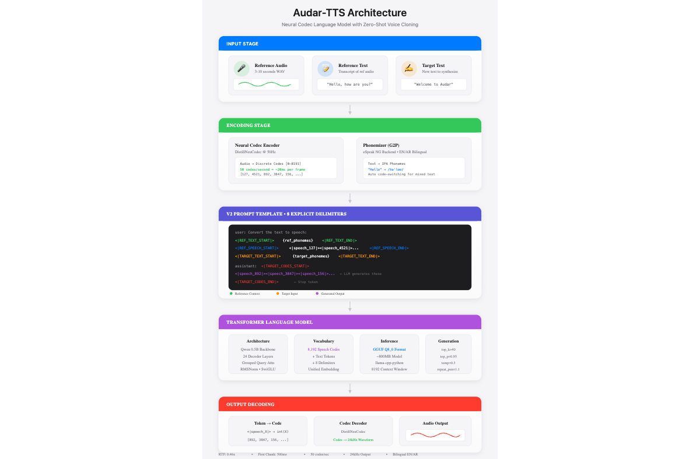
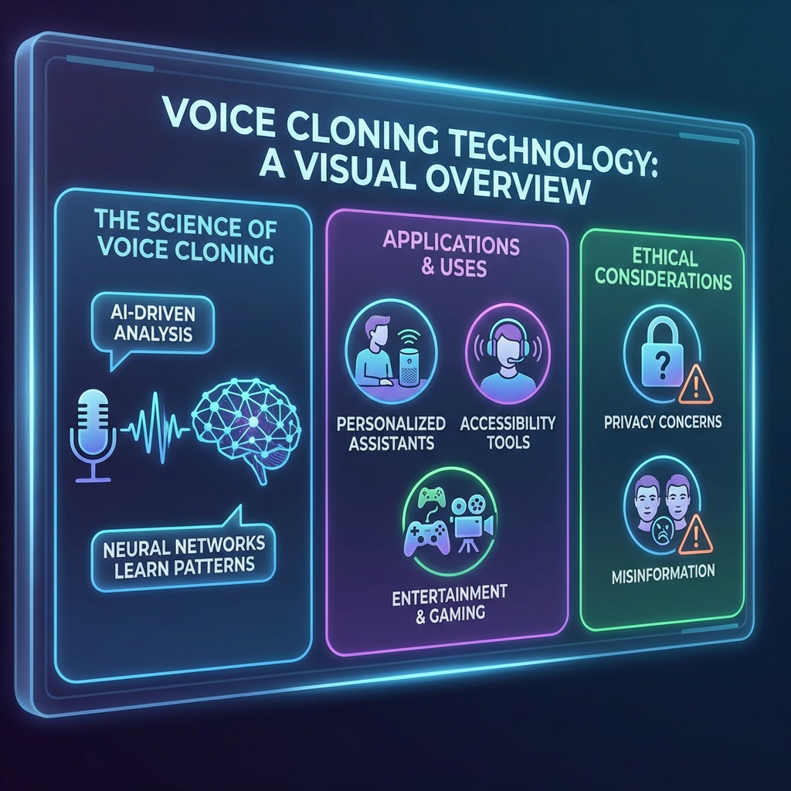
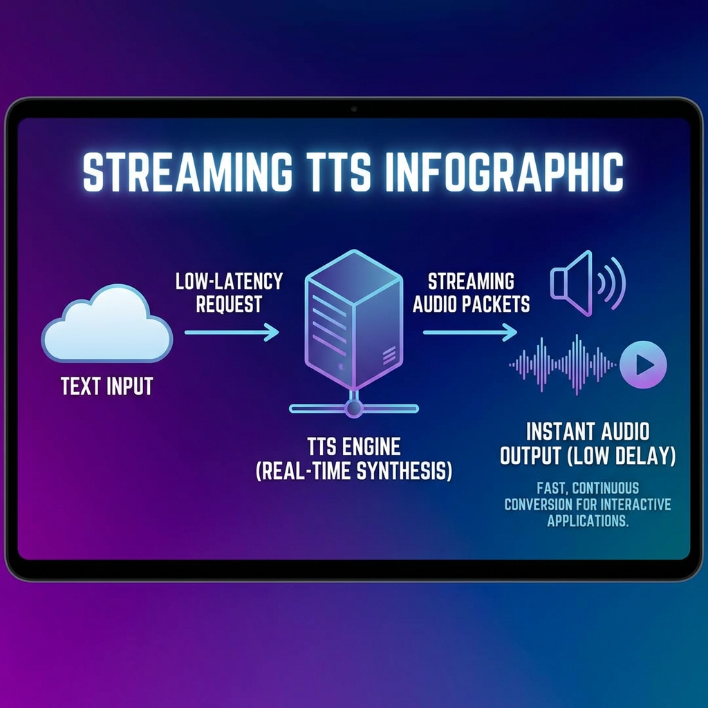
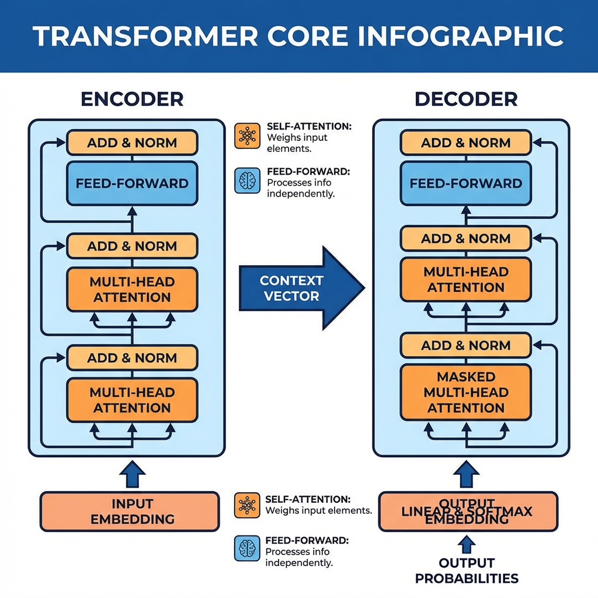

<p align="center">
  
</p>

<h1 align="center">Audar-TTS</h1>

<p align="center">
  <strong>Lightning-Fast Zero-Shot Voice Cloning</strong>
</p>

<p align="center">
  <a href="#features">Features</a> •
  <a href="#installation">Installation</a> •
  <a href="#quick-start">Quick Start</a> •
  <a href="#api-reference">API</a> •
  <a href="#performance">Performance</a>
</p>

<p align="center">
  
  
  
  
</p>

---

Clone any voice with just **3 seconds** of audio. Generate natural speech **2x faster than real-time**.

## Features

| Feature | Description |
|---------|-------------|
| **Zero-Shot Cloning** | Clone any voice without fine-tuning |
| **Real-Time Speed** | 0.46x RTF (2.2x faster than playback) |
| **Low Latency** | ~500ms to first audio chunk |
| **Streaming** | Generate audio progressively |
| **Bilingual** | English + Arabic with code-switching |
| **Speaker Caching** | Instant reuse of encoded voices |

<p align="center">
  
</p>

## Installation

```bash
# Clone the repository
git clone https://github.com/AudarAI/Audar-TTS-V1.git
cd Audar-TTS-V1

# Install dependencies
pip install -r requirements.txt

# System dependency (for phonemization)
# macOS
brew install espeak-ng

# Ubuntu/Debian
sudo apt-get install espeak-ng
```

## Quick Start

### Python API

```python
from audar_tts import AudarTTS

# Initialize (auto-downloads model from HuggingFace)
tts = AudarTTS()

# Basic synthesis
audio, metrics = tts.speak(
    "Hello! Welcome to Audar TTS.",
    speaker="Eve",
    output="hello.wav"
)
print(f"Generated {metrics['duration']:.1f}s audio")

# Streaming (low latency)
for chunk, info in tts.stream("Long text here...", speaker="Eve"):
    play_audio(chunk)  # Play each ~1s chunk as it's generated
    print(f"Chunk {info['chunk']}: {info['duration']:.1f}s")

# Clone a new voice
tts.clone_voice(
    name="my_voice",
    audio_path="reference.wav",      # 3-10 seconds
    transcript="What I said in the recording"
)
tts.speak("Now speaking in the cloned voice!", speaker="my_voice")
```

### Command Line

```bash
# Basic synthesis
python audar_tts.py "Hello world!" -s Eve -o output.wav

# Streaming mode
python audar_tts.py "Long text here" -s Eve --stream

# Clone and use custom voice
python audar_tts.py "Hello!" -s my_voice --clone recording.wav --transcript "Original text"

# List available voices
python audar_tts.py --list-voices

# Arabic text
python audar_tts.py "مرحبا بالعالم" -s Abdullah --lang ar
```

## API Reference

### AudarTTS Class

```python
AudarTTS(
    model_path=None,      # Path to GGUF model (auto-downloads if None)
    voices_dir=None,      # Directory with voice profiles
    n_ctx=8192,           # Context window size
    verbose=False,        # Enable verbose logging
    lazy_load=False       # Defer model loading
)
```

### Methods

| Method | Description | Returns |
|--------|-------------|---------|
| `speak(text, speaker, output, lang)` | Synthesize speech | `(audio_array, metrics)` |
| `stream(text, speaker, lang, chunk_size)` | Stream synthesis | Generator of `(chunk, metrics)` |
| `clone_voice(name, audio_path, transcript)` | Clone a voice | `Speaker` object |
| `voices` | List available voices | `List[str]` |

### Metrics Dictionary

```python
{
    'duration': 3.5,        # Audio duration (seconds)
    'total_time': 1.6,      # Processing time (seconds)
    'rtf': 0.46,            # Real-time factor
    'num_codes': 175,       # Speech codes generated
    'tok_per_sec': 109.4    # Generation speed
}
```

## Streaming Architecture

<p align="center">
  
</p>

The streaming API generates audio in ~1 second chunks:

```python
for audio_chunk, metrics in tts.stream("Your text here", speaker="Eve"):
    # Each chunk is ~1 second of audio (50 codes)
    # First chunk arrives in ~500ms
    play_audio(audio_chunk)
```

## Performance

| Metric | Value |
|--------|-------|
| **Real-Time Factor** | 0.46x (2.2x faster than real-time) |
| **First Chunk Latency** | ~500ms |
| **Reference Audio** | 3-10 seconds |
| **Model Size** | ~800MB (Q8 quantized) |
| **Sample Rate** | 24kHz |

### Hardware Requirements

| Configuration | RTF | First Chunk |
|---------------|-----|-------------|
| CPU (8-core) | ~1.2x | ~1.5s |
| GPU (RTX 3060) | ~0.5x | ~0.6s |
| GPU (RTX 4090) | ~0.3x | ~0.3s |
| Apple M2 Pro | ~0.6x | ~0.7s |

## Model Architecture

<p align="center">
  
</p>

Audar-TTS uses a neural codec language model architecture:

- **Encoder**: Neural audio codec (discrete speech tokens)
- **Core**: Transformer language model (24 layers)
- **Decoder**: Autoregressive speech code generation

See [TECHNICAL_REPORT.md](TECHNICAL_REPORT.md) for detailed documentation.

## Voice Profiles

Place voice profiles in the `voice_profiles/` directory:

```
voice_profiles/
├── Eve.wav              # Reference audio (3-10s)
├── Eve.txt              # Transcript (optional, improves quality)
├── Eve_phonemized.txt   # Pre-phonemized (optional, faster)
└── ...
```

## License

Apache 2.0 - See [LICENSE](LICENSE) for details.

## Citation

```bibtex
@software{audar_tts_2025,
  title={Audar-TTS: Lightning-Fast Zero-Shot Voice Cloning},
  author={Audar AI},
  year={2025},
  url={https://github.com/AudarAI/Audar-TTS-V1}
}
```

---

<p align="center">
  <strong>Built with ❤️ by <a href="https://audar.ai">Audar AI</a></strong>
</p>
